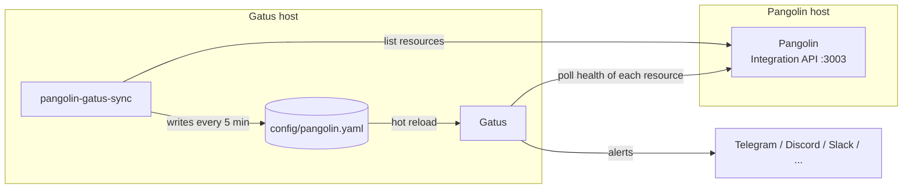

<p align="center">
  
</p>

<h1 align="center">pangolin-gatus-sync</h1>

<p align="center"><b>Show your Pangolin resources on your Gatus status page, with automatic discovery and alerts.</b></p>

<p align="center">
  <a href="https://github.com/reallovedone/pangolin-gatus-sync/actions/workflows/ci.yml"></a>
  <a href="LICENSE"></a>
  
  
</p>

`pangolin-gatus-sync` is a small **Gatus sidecar** for self-hosted
[Pangolin](https://github.com/fosrl/pangolin) (the tunneled reverse proxy built on WireGuard and Traefik).
It reads your resources from the Pangolin Integration API and turns every resource that has a health check
into a [Gatus](https://github.com/TwiN/gatus) endpoint. Add a resource in Pangolin and it shows up on your status
page. Delete it and it disappears. When a resource goes down, Gatus sends the alert through Telegram, Discord,
Slack, ntfy, email or any other provider it supports. The endpoints you wrote by hand in Gatus are left alone.

It also works with the **community edition** of Pangolin. There, the built-in health-check alert rules are
not available.

## Features

- **Zero manual configuration:** resources are discovered, added and removed automatically.
- **Uses Pangolin's own health checks.** The status Pangolin computes for its targets (`healthy` /
  `unhealthy` / `unknown`) becomes a Gatus condition.
- **Alerts for any Gatus provider,** with failure and success thresholds and resolve notifications.
- **Keeps your existing Gatus setup:** it writes a single file (`pangolin.yaml`) next to your config.
- **Monitor stays up when Pangolin goes down:** run Gatus on a different host. If the Pangolin host goes
  down, the status page still reports it.
- **Safe by design:**
  - the API key is never written to disk;
  - files are replaced atomically;
  - a failed or empty API response never wipes your endpoints.
- **Tiny and transparent:** one Python file, standard library only, a 64 MB container with a read-only
  filesystem and no capabilities.
- **Filters:** include or exclude resources by name or domain with glob patterns.

## How it works



1. Every `SYNC_INTERVAL` seconds the sidecar lists the organization's resources.
2. It picks every enabled resource where at least one target has an active health check.
3. For each one it writes a Gatus endpoint that polls `GET /v1/public-resource/{id}` and checks
   `[BODY].data.health`. The endpoint is red when the resource is `unhealthy`.
4. It adds one `Pangolin API` endpoint, so you can tell "the API is unreachable" apart from
   "a service is down".
5. Gatus loads every YAML file in its config folder and reloads it when the file changes. The sidecar
   writes only when something actually changed.

## Quick start

### 1. Pangolin: create an API key and expose the API

- In the Pangolin dashboard go to **Organization → API Keys** and create a key with read access to
  resources.
- Publish the Integration API on the Pangolin host, **only on the LAN address** that the Gatus host can
  reach. In the Pangolin `docker-compose.yml`:

  ```yaml
  services:
    pangolin:
      ports:
        - "192.168.1.10:3003:3003"   # Integration API, LAN only
  ```

  Check from the Gatus host:

  ```bash
  curl -s -H "Authorization: Bearer $KEY" http://192.168.1.10:3003/v1/org/my-org/public-resources?pageSize=1
  ```

### 2. Gatus: use a config folder and pass the key

Gatus merges every `.yaml` file in a folder. Move your existing `config.yaml` into a folder and give Gatus
the same API key:

```yaml
services:
  gatus:
    image: twinproduction/gatus:latest
    environment:
      GATUS_CONFIG_PATH: /config
      PANGOLIN_API_KEY: ${PANGOLIN_API_KEY}   # referenced by the generated endpoints
    volumes:
      - ./config:/config                      # contains your config.yaml
```

### 3. Run the sidecar

```bash
git clone https://github.com/reallovedone/pangolin-gatus-sync.git
cd pangolin-gatus-sync
cp .env.example .env        # fill in PANGOLIN_API_URL, PANGOLIN_ORG_ID, PANGOLIN_API_KEY, GATUS_CONFIG_DIR
docker compose run --rm pangolin-gatus-sync --dry-run   # preview the generated config
docker compose up -d --build
```

The **Pangolin** group then appears on your Gatus dashboard.

## Configuration

| Variable | Default | Description |
|---|---|---|
| `PANGOLIN_API_URL` | *required* | Integration API base URL, e.g. `http://192.168.1.10:3003/v1` |
| `PANGOLIN_ORG_ID` | *required* | Pangolin organization id |
| `PANGOLIN_API_KEY` | *required* | API key (`ID.SECRET`). Gatus needs it too, as an environment variable |
| `GATUS_CONFIG_DIR` | *required* | Host folder Gatus reads its config from (compose only) |
| `GATUS_ALERT_TYPES` | *(none)* | Comma-separated alert providers, e.g. `telegram,email`. Each must be configured under `alerting:` |
| `ALERT_FAILURE_THRESHOLD` | `2` | Consecutive failures before alerting |
| `ALERT_SUCCESS_THRESHOLD` | `1` | Consecutive successes before resolving |
| `GATUS_GROUP` | `Pangolin` | Group name on the status page |
| `SYNC_INTERVAL` | `300` | Seconds between two syncs |
| `CHECK_INTERVAL` | `60s` | Gatus polling interval for each resource |
| `FAIL_ON_UNKNOWN` | `false` | Also fail when Pangolin reports `unknown`, e.g. a check that never completed |
| `RESOURCE_INCLUDE` | *(all)* | Comma-separated globs matched against name and domain |
| `RESOURCE_EXCLUDE` | *(none)* | Comma-separated globs to skip, e.g. `*.dev.example.com,Test*` |
| `GATUS_API_ENDPOINT` | `true` | Add the `Pangolin API` reachability endpoint |
| `PANGOLIN_TLS_VERIFY` | `true` | Verify TLS certificates (sync and Gatus checks) |
| `OUTPUT_FILE` | `/config/pangolin.yaml` | Generated file, inside the container |
| `HTTP_TIMEOUT` | `15` | API timeout in seconds |
| `LOG_LEVEL` | `INFO` | `DEBUG`, `INFO`, `WARNING`, `ERROR` |

Command line: `--once` (single sync), `--dry-run` (print the YAML, write nothing),
`--healthcheck` (used by the container health check), `--version`.

### Example generated endpoint

```yaml
endpoints:
  - name: "Nextcloud"
    group: "Pangolin"
    url: "http://192.168.1.10:3003/v1/public-resource/12"
    interval: "60s"
    headers:
      Authorization: "Bearer ${PANGOLIN_API_KEY}"
    conditions:
      - "[STATUS] == 200"
      - "[BODY].data.health == any(healthy, unknown)"
    ui:
      hide-hostname: true
      hide-url: true
      hide-port: true
    alerts:
      - type: "telegram"
        failure-threshold: 2
        success-threshold: 1
        send-on-resolved: true
        description: "Pangolin resource cloud.example.com is unhealthy"
```

## FAQ

**Which resources are monitored?**
Enabled resources where at least one target has a health check enabled in Pangolin (*Resource → Targets →
Health check*). Resources without a health check report `unknown` forever, so they are skipped. To monitor
them, enable the check in Pangolin, or add a plain HTTP check on their domain in Gatus.

**Why poll the Pangolin API instead of the services directly?**
Pangolin already checks every target from inside the site, including services that are not exposed publicly.
Reusing that status avoids duplicated checks and false alarms caused by authentication or SSO pages.

**What happens if the API key is wrong or Pangolin is down?**
The sidecar keeps the last good file. In Gatus every Pangolin endpoint turns red together, and the
`Pangolin API` endpoint tells you why. A higher `ALERT_FAILURE_THRESHOLD` softens short blips.

**Is the key exposed on the status page?**
No. The generated file only contains `${PANGOLIN_API_KEY}`. URLs and hostnames are hidden in the UI.
Resource names are visible, so use `RESOURCE_EXCLUDE` for anything you do not want to show.

**Does it need the Pangolin Cloud or Enterprise edition?**
No. It only uses the resource endpoints of the Integration API, which the community edition also has.

## Development

```bash
python -m venv .venv && . .venv/bin/activate        # Windows: .venv\Scripts\activate
pip install -r requirements-dev.txt                 # only PyYAML, used by the tests (the script has no dependencies)
python -m unittest discover -s tests -v             # unit tests against a fake Pangolin API
docker compose -f e2e/compose.yaml up -d --build    # fake Pangolin + sidecar + real Gatus
python e2e/check.py
docker compose -f e2e/compose.yaml down -v
```

Contributions are welcome. Please open an issue first if you plan a larger change.

## License

[MIT](LICENSE)

---

*Keywords: Pangolin health check monitoring, Pangolin status page, Gatus Pangolin integration, Gatus auto
discovery, Gatus sidecar, self-hosted uptime monitoring, Fossorial Pangolin alerts, homelab reverse proxy
monitoring, Traefik WireGuard tunnel status page.*
